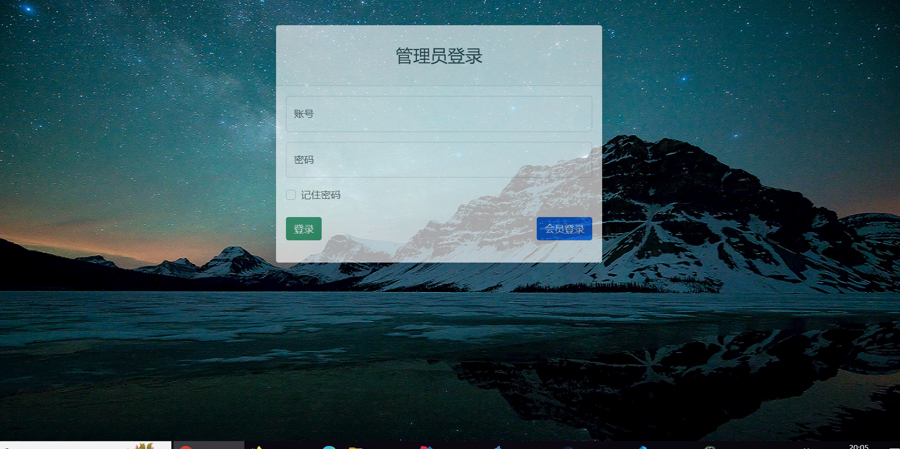

# 一、前言
毕业设计项目，2023年6月10日开始开发，目前还在开发中，希望喜欢！

# 二、项目介绍

## 1.功能设计

## 2.数据库设计

## 3.项目文件结构

## 4.技术框架
* web框架：Spring Boot 2.5.3
* 数据库框架：MyBatis
* 数据库：MySQL
* 项目构建工具：Maven
* 模板引擎：Thymeleaf
* 前端样式：<https://startbootstrap.com/template/sb-admin>

## 5.开发环境
* IDE：IDEA 2021.2
* JDK：1.8
* 数据库：MySQL 8.0.25
####注意：mysql8和mysql5的jdbc区别

# 三、项目主要功能展示
## 登录页面

## 管理员页面

## 会员页面

# 四、总结
第一次做项目，有很多想实现的功能碍于个人能力不够无法实现，基础也不牢固，继续保持学习。写本文的同时也是对这一阶段学习的总结。

### 附加
这个项目我已经开源到我的github，有兴趣的同学自取
地址：<https://github.com/JDC2001/YiChaoShi_java.git>

